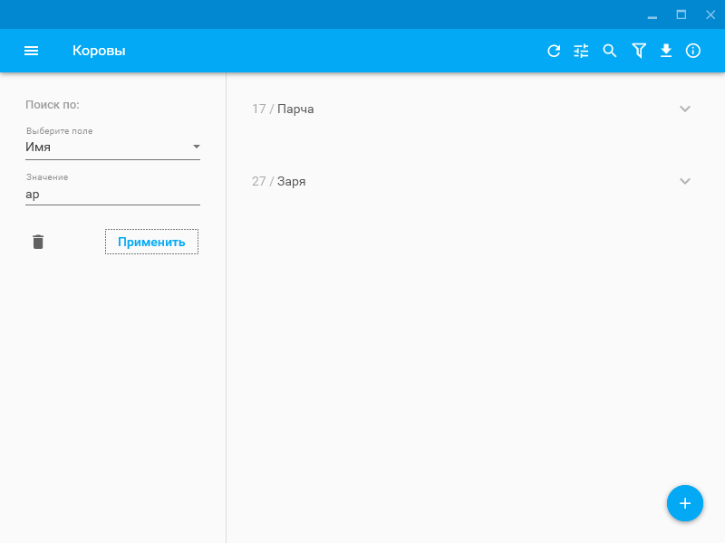

# Farming

This project is the implementation of an automated information system for farming.

## Dependencies

* ORM - [Entity Framework 6](https://github.com/aspnet/EntityFramework6)
* Export to PDF - [ITextSharp](https://github.com/itext/itextsharp)
* Styles of controls - [MaterialDesignInXamlToolkit](https://github.com/ButchersBoy/MaterialDesignInXamlToolkit)

## Screenshots

  

  

  

  

> The Entities for Manager role.

  

> The Entities for Admin role.

  

  

  

  

  

  

  

  

  

  

  

  

> The Manager can not delete data

  

> Sorting

  

> Filtration

  

> Searching

  

  

> Export to PDF

  

